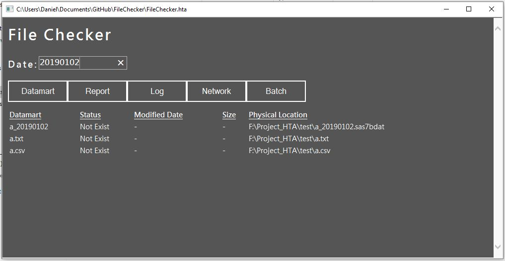

# FileChecker

Small Project aims to achieve automatic file checking by just HTA window application for file existing and log error checker which is embed in IE (not many big companies are able to use Chrome at that time).

### Main Features:
- Enable to check different file status
- Easy to switch by date input
- Instantly refresh
- Check Log data with "ERROR" Message by word search

